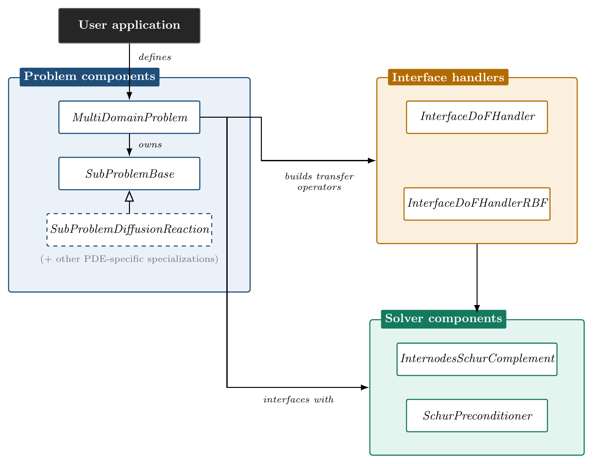

# dealii-internodes

A [deal.II](https://www.dealii.org/) implementation of the **INTERNODES**
method for coupling PDE solutions across non-conforming subdomain interfaces
(discretization and/or geometric non-conformity), using Lagrange
interpolation for conforming interfaces and rescaled localized
radial-basis-function (RL-RBF) interpolation otherwise. The coupled problem
is solved through a preconditioned, matrix-free Schur-complement strategy
(GMRES on the interface problem, Dirichlet–Neumann-type preconditioner).
It implements the method described in *[paper title/venue — to be added]*.



A user application defines the problem — geometry, boundary conditions,
physics — by building a `SubProblemBase` subclass for each subdomain (e.g.
`SubProblemDiffusionReaction`, the diffusion–reaction model provided here)
and coordinating them with a `MultiDomainProblem`. That builds the interface
transfer operators, via `InterfaceDoFHandler` for geometrically matching
interfaces or `InterfaceDoFHandlerRBF` for non-matching ones, and hands the
coupled problem to `InternodesSchurComplement`, preconditioned by
`SchurPreconditioner`. `examples/coupled_diffusion` is a complete, minimal
instance of this — a good starting point for a new PDE model or driver.

## Dependencies

- **CMake** ≥ 3.13 and a C++17 compiler
- **MPI** (OpenMPI or MPICH)
- **[deal.II](https://www.dealii.org/)** ≥ 9.5 (developed and tested with
  9.8.0), configured with MPI, **Trilinos** (`TrilinosWrappers` linear algebra
  and the ML/MueLu algebraic multigrid) and **p4est** (hexahedral meshes).
  METIS is *not* required.

The easiest way to get a correctly configured `deal.II` is
[`candi`](https://github.com/dealii/candi), which builds `deal.II` together
with Trilinos and p4est from source:

```bash
git clone https://github.com/dealii/candi.git
cd candi
./candi.sh --packages="p4est trilinos dealii"
```

On a cluster with a module system, load (or build) `deal.II` with the same
components and set `DEAL_II_DIR` as below.

## Building

```bash
mkdir build && cd build
cmake -DDEAL_II_DIR=/path/to/dealii/install ..
make -j<N>
```

If `deal.II` is installed in a standard location, `cmake ..` alone should find
it. The configure step stops with a clear message if `deal.II` lacks Trilinos
or p4est.

## Running the example

`examples/coupled_diffusion` solves the paper's manufactured-solution test,
$-\Delta u + u = f$ with $u = e^{x+y+z}$ on $\Omega = (-2,2)\times(-1,1)^2$,
split at $x = 0$ into a *master* and a *slave* subdomain, and prints the
number of interface-GMRES iterations and the broken $H^1$ error against the
exact solution. Everything is set through a parameter file.

```bash
cd build/examples/coupled_diffusion
mpirun -np 2 ./coupled_diffusion coupled_diffusion.prm      # about 1 s
```

The default file is Geometry-A (two adjacent boxes, hexahedral meshes,
Lagrange interpolation). Copy it and change a few lines to explore the other
cases:

| Case | Parameters to set |
|---|---|
| Mesh resolution | `Subdivisions master/slave` (coarse mesh) and `Global refinement master/slave`: cells per direction = subdivisions × 2^refinement. The coarse mesh is refined on the distributed mesh, so large meshes are cheap to create |
| Non-matching meshes across the interface | Different resulting resolutions on master and slave (e.g. `8,4,4` vs `4,2,2` cells) and an RBF radius (or `RBF radius = 0` for Lagrange interpolation) |
| RBF support radius | `RBF radius` (absolute), or `RBF radius factor` r_f, which sets r = r_f · h_avg on each subdomain, h_avg being the average cell diameter of its own mesh (as in the paper) |
| Different polynomial degrees | `Master degree`, `Slave degree` |
| Geometry-B (curved shell interface, tetrahedra) | `Type = half_hyper_shells`, `RBF radius` > 0, `Shell refinement master/slave` |
| Single-domain reference solve | `Run/Mode = monolithic`: the same problem on the union of the two boxes at the master's resolution (CG with algebraic multigrid). Used for the paper's comparison with a single-domain solver |
| Effect of the Schur preconditioner | `Solver/Use Schur preconditioner = false` for the unpreconditioned GMRES iteration count |
| Machine-readable results | `Run/Results file = out.json`, see below |
| Dirichlet / Neumann / interface assignment | `Dirichlet ids …`, `Neumann ids …`, `Interface id …` per subdomain, as lists of boundary ids |

Boundary ids are those of the mesh you build: for the boxes the
`colorize = true` ids of `GridGenerator::subdivided_hyper_rectangle`
(0/1 = −x/+x, 2/3 = −y/+y, 4/5 = −z/+z), for the shells those of
`GridGenerator::half_hyper_shell` (0 = inner surface, 1 = outer surface,
2 = flat cut). Any id, including 0, may be used on hexahedral and on
tetrahedral meshes.

### Results file

With `Run/Results file = out.json` rank 0 writes a JSON file with the run
configuration, the number of MPI ranks, the DoF, interface-DoF and cell counts
and the average cell diameter of each subdomain, the RBF radii, the number of
GMRES iterations, the broken $H^1$ error (in total and per subdomain), and the
wall time of every timed phase (maximum over the ranks, and number of calls):
subproblem and RBF setup, destination-point setup, assembly, Steps 1–4, the
RBF `Φ` solve, the normal-derivative evaluation, and so on. It also has the
wall-clock time of the whole program (`total_wall`), the tolerances of the
inner CG solves, and the number of solves and CG iterations of each kind
(`cg`). This is what the scripts in `reproduce/` are meant to read.

### Verified results

All numbers below were produced by this code (deal.II 9.7.0, Trilinos 16.2.0,
p4est 2.8.7, OpenMPI). Results are independent of the number of MPI ranks
(checked on 1, 2 and 4 ranks; identical to the printed digits).

Geometry-A, conforming interface (`RBF radius = 0`), broken $H^1$ error:

| Mesh (per subdomain) | $\mathbb{P}_1$ | ratio | $\mathbb{P}_2$ | ratio |
|---|---|---|---|---|
| `4,2,2`    | 9.48113 |      | 0.989073  |      |
| `8,4,4`    | 4.27465 | 2.22 | 0.251874  | 3.93 |
| `16,8,8`   | 2.07294 | 2.06 | 0.0632763 | 3.98 |
| `32,16,16` | 1.02826 | 2.02 |           |      |

i.e. the optimal rates 1 and 2 under refinement. The single-domain reference
solve on the same mesh gives identical errors (e.g. 2.07294 for $\mathbb{P}_1$
and 0.0632763 for $\mathbb{P}_2$ on `16,8,8`). Meshes are listed as cells per
direction of each subdomain; they are produced as a coarse mesh refined
globally (e.g. `16,8,8` is `4,2,2` with 2 refinements) and give the same
results as building the fine mesh directly.

Geometry-A, geometrically matching but discretization-non-conforming
interface (master mesh twice as fine as the slave's), $\mathbb{P}_1$:

| Master / slave subdivisions | Lagrange: error (GMRES its) | RL-RBF: error (GMRES its) |
|---|---|---|
| `8,4,4` / `4,2,2`      | 9.42269 (7) | 9.42358 (6) |
| `16,8,8` / `8,4,4`     | 4.24635 (7) | 4.24654 (6) |
| `32,16,16` / `16,8,8`  | 2.05898 (6) | 2.05902 (6) |

The RL-RBF support radii used were 2.0, 1.0 and 0.5 for the three rows, i.e.
proportional to the interface mesh size. The Schur preconditioner reduces the interface iterations from 15 to 6 on the
first row (RL-RBF). The interface iteration count does
not grow under refinement, and both interpolation choices reach the same
discretization-limited accuracy.

Geometry-B (two half shells, tetrahedral, RL-RBF), $\mathbb{P}_1$:

| Shell refinement master / slave | error | GMRES its |
|---|---|---|
| 1 / 1 | 0.812484 | 9  |
| 2 / 2 | 0.421800 | 8  |
| 2 / 1 (non-matching) | 0.845792 | 13 |

## Reproducing the paper's full results

`reproduce/` contains parameter files for the configurations of the paper's
accuracy and strong-scaling studies (Table 4). **These are not meant to be
run by a reviewer or casual user**: the scalability configurations need
distributed-memory HPC resources (the paper's runs used up to 500+ MPI
processes and ~10 million degrees of freedom). See `reproduce/README.md` for
what each configuration requires and how it maps to the paper.

Two things differ from the paper's setup, so figures will not match to the
last digit:

- the paper's meshes were generated externally (Geometry-A hexahedral,
  Geometry-B tetrahedral via Gmsh) rather than by this code. Here both are
  generated by deal.II's own `GridGenerator`, the shells by converting a
  hexahedral half shell to tetrahedra;
- the mesh sizes in `reproduce/*.prm` are placeholders to be adjusted to the
  degrees-of-freedom counts of the paper's Table 4.

## Notes on the port

- **Meshes.** `MeshHandler` distributes a serial `Triangulation` built by the
  user: hexahedral meshes with `parallel::distributed::Triangulation`
  (p4est), tetrahedral meshes with `parallel::fullydistributed::Triangulation`
  (z-order partitioning, no METIS). Hexahedral meshes should be passed as a
  *coarse* mesh and refined with `refine_global` on the distributed
  triangulation (p4est treats every cell of the input as a tree, so building
  the fine mesh serially does not scale). Simplex meshes cannot be
  refined by deal.II: refine the hexahedral mesh before converting it, or read
  a sufficiently fine mesh from file. Matching `FE_Q` / `FE_SimplexP`,
  quadratures and mappings are chosen from the cell type. For tetrahedral
  meshes the boundary ids are shifted by one internally, because a
  fully-distributed triangulation labels partition boundaries with the default
  id 0; this is transparent to the user.
- **Interface mass matrix inverse.** $M_{\Gamma_2}^{-1}$ in the residual
  transfer is applied with Jacobi-preconditioned CG. The diagonally scaled
  mass matrix is well conditioned independently of the mesh, and this proved
  more robust than algebraic multigrid with a direct coarse solver on small
  parallel interface matrices.
- **GMRES.** The interface GMRES uses right preconditioning and no restart
  (`GMRES right preconditioning`, `GMRES basis size`); deal.II's own
  defaults are left preconditioning and a restart after 28 iterations. The
  stopping criterion is an absolute tolerance on the residual norm and,
  optionally, a reduction relative to the initial residual (`GMRES reduction`).
- **Inner tolerances.** The inner CG solves (the subdomain solves, the
  auxiliary problem of the Schur preconditioner, the interface mass matrix,
  and the RBF matrix) use by default absolute / relative tolerances of
  $10^{-13}$ / $10^{-11}$ ($10^{-12}$ / $10^{-10}$ for the RBF matrix) — much
  tighter than the outer GMRES tolerance ($10^{-8}$). They are parameters
  (`Solver/Subdomain solve tolerance`, `… reduction`, `Preconditioner solve …`,
  `Interface mass solve …`, `RBF solve …`), and the results file reports the
  CG iterations each kind took, so the effect of relaxing them can be
  measured; the defaults are the values of the paper's runs.
- **Naming.** The class names match the architecture diagram above; a new
  PDE model is a `SubProblemBase` subclass overriding `localBilinearForm()`.
- **deal.II version portability.** Tested against both 9.7.0 and 9.8.0;
  `ReferenceCell` became templated on dimension between them, so
  `MeshHandler::is_hex`/`is_tet` use `auto` rather than spelling out
  `std::vector<ReferenceCell>`, to stay correct across the `>= 9.5` range
  this port claims. If a future deal.II version changes another such
  type, expect a similar compile error naming the exact mismatch, not a
  silent problem.
- **MPI implementation matters, not just deal.II version.** Two bugs
  (`timer_output()` doing an MPI collective in its destructor after
  `MPI_Finalize` had already run; that same summary printing once per
  rank instead of once total, from using the wrong `TimerOutput`
  constructor overload) were both silent on OpenMPI and hard failures on
  Intel MPI/MPICH. Local single-machine testing with OpenMPI is not a
  substitute for testing on the MPI implementation reviewers or an HPC
  cluster will actually use.

## Repository layout

```
include/internodes/   Headers (SubProblemBase and PDE subclass, MultiDomainProblem,
                      InternodesSchurComplement, SchurPreconditioner, interface
                      DoF handlers (Lagrange, RBF), MeshHandler, R-tree search)
source/               Corresponding implementation files
examples/             Small, reviewer-runnable example (coupled_diffusion)
reproduce/            Paper-reproduction configurations (HPC-scale)
docs/                 Architecture figure (source + rendered)
```

## Status

The hexahedral and tetrahedral code paths, serial and parallel, are validated
as described above, on both a local machine (deal.II 9.7.0/9.8.0, OpenMPI)
and an HPC cluster (CINECA Galileo100, deal.II 9.8.0, Intel MPI). The
HPC-scale configurations in `reproduce/` have not yet been run at full size
in this port. Only the diffusion–reaction model is provided; other PDEs need
a new `SubProblemBase` subclass.

## License

MIT — see `LICENSE`.

## Citation

If you use this code, please cite:

```
[BibTeX entry — to be added once the paper is published]
```
